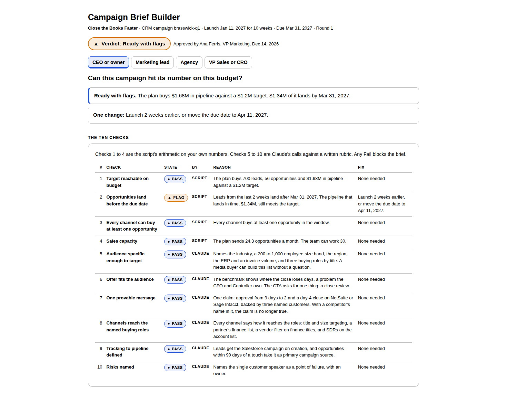

# Campaign Brief Builder

## What problem does it solve?

Campaigns launch on a strategy nobody tested. Then each team gets a partial brief: ads hears one thing, sales hears another, creative guesses. Work ships that does not tie to pipeline.

## How does it solve it?

Paste your campaign strategy. A script works back from your pipeline target to the opportunities, leads, budget and weeks it takes, at your own rates, and checks whether the budget, the timeline and your sales team can carry it. Claude tests the rest against a written rubric: audience, offer, message, channel reach, tracking and risks. Once the strategy passes and you approve it, the skill builds one brief. Every requirement traces to a line in your strategy.

## What does it unlock?

A go or no-go on whether the budget and the timeline can hit the pipeline target, and one brief every team works from, each requirement tied to that target.

## Four readouts, one analysis

Tell Claude your seat. The checks and the brief are the same. The answer is built for the question you bring.

| Seat | The question it answers |
|---|---|
| CEO or owner | Can this campaign hit its number on this budget? |
| Marketing lead | Is my strategy ready to launch, and what fails first? |
| Agency | What exactly are we on the hook to deliver, and is the target realistic? |
| VP Sales or CRO | What will sales get, when, and what do we owe the campaign? |

## What does it check?

Ten checks. Each one returns Pass, Flag or Fail, with the fix.

| # | Check | Who judges it |
|---|---|---|
| 1 | Target reachable on budget | Script |
| 2 | Opportunities land before the due date | Script |
| 3 | Every channel can buy at least one opportunity | Script |
| 4 | Sales capacity | Script |
| 5 | Audience specific enough to target | Claude, against the rubric |
| 6 | Offer fits the audience | Claude, against the rubric |
| 7 | One provable message | Claude, against the rubric |
| 8 | Channels reach the named buying roles | Claude, against the rubric |
| 9 | Tracking to pipeline defined | Claude, against the rubric |
| 10 | Risks named | Claude, against the rubric |

## What is the verdict?

| Verdict | When | What happens |
|---|---|---|
| Not ready | Any check fails | The brief is blocked. No override |
| Untested | Nothing fails, and a required number is your guess | The brief builds, stamped Untested, with tasks to replace each guess |
| Ready with flags | Nothing fails, no guesses, at least one Flag | The brief builds. Each Flag becomes a risk with an owner |
| Ready | All ten pass | The brief builds |

The script assembles the verdict from the ten states. Claude never picks it.

## How does the reverse funnel work?

Target ÷ average deal size = opportunities needed. Opportunities ÷ your lead-to-opportunity rate = leads needed. Then forward: each channel's budget ÷ its cost per lead = the leads it buys.

In the sample, a $1.2M target at a $30,000 average deal needs 40 opportunities and 500 leads. The $90K plan buys 700 leads and $1.68M in pipeline. Check 1 passes. But leads take 21 days to become opportunities, so the last 2 weeks of leads land after the Mar 31 due date. $1.34M lands in time, still over the target. Check 2 flags it, with the fix: launch 2 weeks earlier, or move the due date to Apr 11.

## What is in the brief?

Six sections, always present: Ads, PR, Content, Operations, Sales enablement, Creative. A section the strategy does not call for reads "Not in this campaign", with the line that rules it out.

Every requirement carries nine fields: ID, function, requirement, the strategy line it traces to, owner, due date, budget, dependencies and a yes-or-no acceptance test. The script sets the IDs, the due dates (counted back from launch on lead times you confirm), the budget lines and the UTMs. It adds the CRM campaign requirement itself, so every opportunity carries the campaign from day one.

The brief measures pipeline, not activity. The primary KPI is pipeline dollars and opportunities by the due date. Leads, opportunities and spend per week are the leading indicators. Clicks and impressions stay in the Ads section as diagnostics.

## What does the tool show?

- **The verdict and the ten checks,** with the reason and the fix for each.
- **The reverse funnel.** What the target needs against what the plan buys, and what lands in time, by channel.
- **What if?** Move budget, cost per lead, rate, lag or target and see checks 1 and 2 again. It never changes the approved brief.
- **Weekly pacing.** Pipeline landing week by week against the target and the due date.
- **The brief,** section by section, with a filter by owner, the risks, the lead times and a budget check.
- **Exports.** The brief as Markdown, the requirements as CSV for any task tool, and a print view for PDF.

## How do I learn the method?

Read [the method guide](../skills/campaign-brief-builder/references/method-guide.md) for every number, and [the rubric](../skills/campaign-brief-builder/references/rubric.md) for every call Claude makes. Or ask Claude "how is check 2 built?" after a run.

## What do I need first?

Read [the prerequisites](../skills/campaign-brief-builder/references/prerequisites.md). The short version:

- Any Claude plan with code execution on
- A campaign strategy: pasted text, a doc or a deck. No strategy? Ask for [the template](../skills/campaign-brief-builder/references/strategy-template.md)
- A pipeline target and due date, budget and cost per lead for every channel, a launch date and run length
- Your own funnel numbers: average deal size, the share of leads that become opportunities, and the days that takes
- Sales capacity, and how an opportunity gets credited in your CRM, to turn two Flags into Passes

No connectors or MCP servers are needed.

## How do I use it?

1. Paste your strategy into Claude and say: "Pressure test this campaign. I'm the CEO." Swap in your own seat.
2. Answer the questions it asks, one at a time.
3. Revise until nothing fails, then approve.
4. Open the tool file Claude hands back, and export the brief.

No strategy handy? Paste [the sample](../examples/campaign-brief-builder/sample_strategy.md) first, or open the [sample tool](../examples/campaign-brief-builder/sample_tool.html).

## What will it not do?

- Write your strategy. You write it. The skill tests it
- Write the ads, the press release or the content. The brief sets the requirements
- Use benchmarks. Every rate is yours
- Forecast. Every number is a projection at your own rates
- Override a Fail
- Track the campaign after launch
- Set anything up in an ad platform or a CRM
- Judge creative taste

## Where does the sample come from?

It is synthetic. Brasswick, its customers, its people and its agency are invented and published under MIT with the repo. The sample is built to land on Ready with flags: the budget clears the target, the last two weeks of leads land after the due date, and PR is not in the campaign, so that section shows how a function that is not in the campaign reads. See [the examples folder](../examples/campaign-brief-builder/).

## How was it tested?

Six test strategies: a strong one that passes every check, a weak one that fails five, a messy one pasted as free text with an ambiguous date, a blank budget, "TBD" for a cost per lead and a total that does not match its channels, one built on guessed numbers, one where the lead-to-opportunity lag pushes the pipeline past the due date, and one that fails, gets fixed and passes in a second round. Every number was recomputed by a separate answer key, with exact fractions and dates walked one day at a time, and matched. The expected Pass, Flag or Fail for all ten checks was written by hand before the build. Blind runs, with Claude given only the skill and the pasted strategy, matched those calls, and a linter checks that every number Claude writes comes from the script or your strategy. Standard library only, so no library version can move a number. See [tests](../tests/campaign-brief-builder/).
