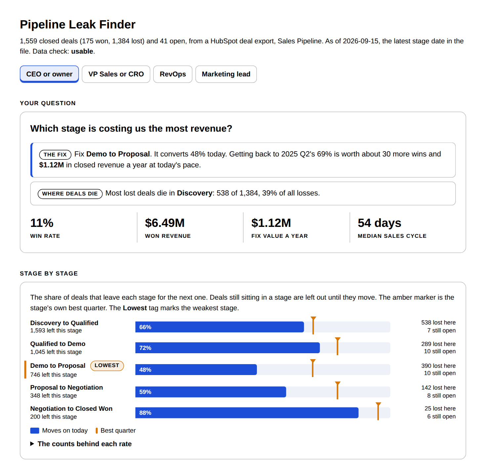

# Pipeline Leak Finder

## What problem does it solve?

Teams know their overall win rate. They do not know which stage kills their deals. Every stage gets the same attention, and the real leak keeps leaking.

## How does it solve it?

Upload a HubSpot or Salesforce deal export with stage history. Claude returns the conversion from each stage to the next, time in each stage and where deals stall, and where lost deals die. Then it ranks every stage by the closed revenue a fix is worth, measured against your own best quarter. It writes the readout for your seat and builds an interactive tool.

## What does it unlock?

One stage to fix first, a dollar figure for fixing it, and the list of deals stuck right now.

## Four readouts, one analysis

Tell Claude your seat. The math is the same. The answer is built for the question you bring.

| Seat | The question it answers |
|---|---|
| CEO or owner | Which stage is costing us the most revenue? |
| VP Sales or CRO | Where do deals stall, and which ones are stuck right now? |
| RevOps or GTM ops | Can I trust the stage data? |
| Marketing lead or agency | Are we feeding the pipeline deals that can close? |

## How does it value a fix?

Against your own best quarter, not an industry benchmark.

For each stage, the skill finds the quarter it converted best. It values the gap: last year's deal volume, times the gap, times the share of deals that win after that stage, times your average won deal. The answer is closed revenue a year if the stage hit that rate again.

Then it asks whether the best quarter was real. Pick the best of ten quarters and one will look good by chance. The skill tests each best quarter against all the others:

| Evidence | What it means | What to do |
|---|---|---|
| Holds up | Too far ahead to be chance. Something was different | Find it and bring it back |
| Could be luck | Within normal swing | Find out what drove it before you spend on it |
| Equal lift | That stage has too few finished quarters to test, so it gets a 10% lift on its own rate | Read it as where a gain is worth most |

In the sample, Demo to Proposal converts 48%. In 2025 Q2 it hit 69%, and that holds up. Getting it back is worth $1.12M a year. Proposal to Negotiation shows a 20-point gap too, worth $851K on paper, but its best quarter could be luck. The skill says so.

## What does the tool show?

- **Stage by stage.** Conversion from each stage to the next, with the best quarter marked. The weakest stage is tagged.
- **Where lost deals die.** Every lost deal at the last stage it reached. By count, by value, or by typical deal size.
- **Time in stage.** Median days, the slow tail, and the stall line: the day by which three in four deals that moved on had left.
- **Does waiting cost deals?** Win rate for deals that left each stage in time, against those that sat past the stall line.
- **The fix worth the most.** Every stage ranked by closed revenue a year, with the evidence behind each target.
- **Try a target.** Pick a stage, drag the target, see the extra wins and revenue. The stage's rate by quarter sits underneath.
- **Stuck right now.** Open deals past their stage's stall line, biggest first, searchable.
- **Can you trust this?** Every data check, the stage order to confirm, and a verdict.

## How do I learn the method?

Every number comes with a plain-language explanation: what it means, how it is built, how to read it and when not to trust it. Read [the method guide](../skills/pipeline-leak-finder/references/method-guide.md), or ask Claude "how is the fix value built?" after a run.

## What do I need first?

Read [the prerequisites](../skills/pipeline-leak-finder/references/prerequisites.md). The short version:

- Any Claude plan with code execution on
- A deal export with stage dates: HubSpot "Date entered" columns, a Salesforce Opportunity History report, or any log of stage changes
- Won, lost and open deals, 12 to 24 months
- At least 40 closed deals with stage history. 150 or more is better
- Amount on won deals

No connectors or MCP servers are needed.

## How do I use it?

1. Export your deals with stage history. Steps for each CRM: [export guide](../skills/pipeline-leak-finder/references/export-guide.md).
2. Upload the CSV to Claude and say: "Where are we losing deals? I'm the CEO." Swap in your own seat.
3. Open the tool file Claude hands back.

No export handy? Try [the sample data](../examples/pipeline-leak-finder/) first, or open the [sample tool](../examples/pipeline-leak-finder/sample_tool.html).

## What will it not do?

- Tell you why a deal was lost. It shows where, not why
- Promise a fix value. It is a projection at today's pace, not a forecast
- Call a lucky quarter a real one
- Add fix values together. Each is valued alone
- Show a percentage behind fewer than 20 deals
- Compare you to other companies

## Where does the sample data come from?

It is synthetic. Every company and deal is invented and published under MIT with the repo. Real leaks are planted in it so the skill has something to find: a weak Demo stage with one real best quarter, proposals that stall and die, big deals lost late, early losses with no amount, a skipped stage, and quarter-to-quarter noise everywhere else. The generator documents every one. The same deals ship as a HubSpot export and a Salesforce history report. See [the examples folder](../examples/pipeline-leak-finder/).

## How was it tested?

Six test files: a clean HubSpot export, a Salesforce Opportunity History report with Salesforce's default stage names, a HubSpot file with ten planted data problems, a Salesforce Field History report, a file too small to analyze, and a plain stage log with custom stage names. Every count, rate, median, stall line and fix value was recomputed from the generator's own deal records, with separate code, and matched exactly. The skill found every planted leak, and on the 600-deal file it refused to call the same leak proven. The HubSpot and Salesforce versions of the sample gave identical answers. Standard library only, so no library version can move a number. See [tests](../tests/pipeline-leak-finder/).
