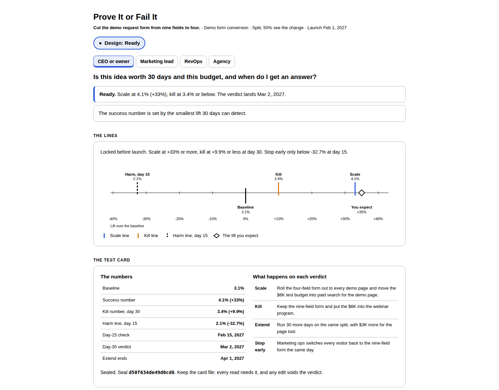

# Prove It or Fail It

## What problem does it solve?

Most growth ideas never get a verdict. Nobody agreed what a win looks like before launch, so every result reads as promising and the idea lives on. Budget stays tied up in tests that never end.

## How does it solve it?

Bring one idea, the one metric it should move, today's baseline, 30 days of volume, the budget and the lift you expect. A script sizes the test and locks three numbers before launch: the success number, the kill number and the day-15 harm line. Claude checks the idea against a written rubric. The numbers and the action the team agrees to for each verdict are sealed on a test card. At day 15 and day 30, the script reads the results against that card and calls the verdict. Nobody moves the goalposts.

## What does it unlock?

A yes or no in 30 days on whether an idea moved the metric, and an action the team agreed to before anyone saw the result.

## Four readouts, one analysis

Tell Claude your seat. The numbers are the same. The answer is built for the question you bring.

| Seat | Before launch | At a read |
|---|---|---|
| CEO or owner | Is this idea worth 30 days and this budget, and when do I get an answer? | Did it work, and what do we do now? |
| Marketing lead | How do I run it so the answer is clean? | What does the result say, and what runs next? |
| RevOps | Can we measure it, and what do I set up? | Is the result clean enough to trust? |
| Agency | What are we testing, and what counts as a win? | Did we win? |

## What does it check?

Six checks. Each one returns Pass, Flag or Fail, with the fix.

| Check | Who judges it |
|---|---|
| Readable in 30 days | Script |
| Pays back at the expected lift | Script |
| One change | Claude, against the rubric |
| The right metric | Claude, against the rubric |
| A clean split | Claude, against the rubric |
| Measurable today | Claude, against the rubric |

## What is the design verdict?

| Verdict | When | What happens |
|---|---|---|
| Too small to read | 30 days cannot detect the lift you expect | No card. Three fixes: more volume, more days, or a bolder idea |
| Not ready | A rubric check fails | No card. Change the idea and run it again |
| Ready with flags | Nothing fails, at least one Flag | The card is sealed. Each Flag is a named risk |
| Ready | All six pass | The card is sealed. Launch |

The script assembles the verdict from the six states. Claude never picks it.

## How is the success number set?

The largest of three lifts:

- **The smallest lift 30 days can detect,** 95% sure, sized to catch a real lift 8 times in 10.
- **The lift that pays back the budget,** when you give the value of one unit.
- **The business's own swing,** for before-and-after tests only: the biggest gap between any 4 weeks of the last 12 and their average.

In the sample, 9,000 visitors split in half can detect a +33% lift on a 3.1% form. Paying back $6,000 at $400 a demo request needs +10.8%. The success number is 4.1%, a +33% lift. The kill number is 3.4%. The harm line at day 15 is 2.1%. You expect +35%, so the test can read it. Ready.

## What are the verdicts at each read?

| Read | Verdict | Rule |
|---|---|---|
| Day 15 | Stop early | The whole range is below zero |
| Day 15 | Keep running | Anything else. A slow start never stops a test |
| Day 30 | Scale | The range is above zero, and the lift is at or above the success number |
| Day 30 | Kill | The top of the range is under the success number |
| Day 30 | Extend | In between. Once, for the days agreed on the card |
| End of Extend | Scale | Same rule as day 30 |
| End of Extend | Kill | Anything else. Unproven, not disproven |

Every read quotes the action the team agreed to for that verdict. In the sample, day 30 comes back at +21.4%, with a range of -2.8% to +45.6%. Extend.

## What is the test card?

A file written at design with the idea, the metric, the dates, the numbers and the four agreed actions, sealed with a fingerprint of all of it. Every read needs the card. Edit a number or an action and the seal breaks: the read refuses and names what changed.

## What does the tool show?

- **The verdict,** answered for your seat.
- **The lines.** Scale, kill and harm on one lift axis, with the lift you expect, or at a read the result and its range.
- **The test card.** The locked numbers, the read dates, the agreed actions and the seal.
- **The six checks,** with the reason and the fix for each.
- **The volume planner.** Move the volume or the days and see the smallest lift the test can detect. It never changes the sealed card.
- **The plan.** The change, who sees it, how people are assigned, what counts, setup and risks.
- **Exports.** The plan as Markdown and a print view for PDF.

## How do I learn the method?

Read [the method guide](../skills/prove-it-or-fail-it/references/method-guide.md) for every number and verdict, and [the rubric](../skills/prove-it-or-fail-it/references/rubric.md) for every call Claude makes. Or ask Claude "how is the kill number built?" after a run.

## What do I need first?

Read [the prerequisites](../skills/prove-it-or-fail-it/references/prerequisites.md). The short version:

- Any Claude plan with code execution on
- One idea, one change. No idea written down? Ask for [the template](../skills/prove-it-or-fail-it/references/idea-template.md)
- One metric, a rate or a count, tracked today, with its baseline from the last 90 days
- 30 days of volume, or 12 weeks of weekly history for a before-and-after test
- The budget, the lift you expect and a launch date
- An action agreed for each verdict: scale, kill, extend, stop early

No connectors or MCP servers are needed.

## How do I use it?

1. Paste your idea into Claude and say: "Prove it or fail it. I'm the CEO." Swap in your own seat.
2. Answer the questions it asks, one at a time.
3. Launch on the card's date. Keep the card file.
4. At day 15 and day 30, bring the card and the results. Claude calls the verdict.

No idea handy? Paste [the sample](../examples/prove-it-or-fail-it/sample_idea.md) first, or open the [sample tool](../examples/prove-it-or-fail-it/sample_tool.html).

## What will it not do?

- Generate or rank ideas. You bring one
- Test more than one change at a time
- Test revenue or deal size in this version
- Change the numbers after launch
- Use benchmarks. Every baseline is yours
- Forecast. A verdict is about this test in this period
- Set anything up in a site, ad platform or CRM

## Where does the sample come from?

It is synthetic. The form, the traffic and the people are invented and published under MIT with the repo. The sample is built to land on Ready at design and Extend at day 30, so it shows the full card and a read that is not yet decided. See [the examples folder](../examples/prove-it-or-fail-it/).

## How was it tested?

Five test designs: a rate split test that passes every check, a count split test with no value per unit, a before-and-after test where the business's own swing sets the bar, one too small to read, and a weak idea that fails two rubric checks. Six reads against those cards: Scale, a disproven Kill, Extend, Stop early, an unproven Kill at the end of an Extend, and a tampered card. Every lift, line, date and verdict was recomputed by a separate answer key and matched. The expected check states and verdicts were written by hand before the build. Blind runs, with Claude given only the skill and the idea, reached every expected verdict, and a linter checks that every number Claude writes comes from the script or the user.
